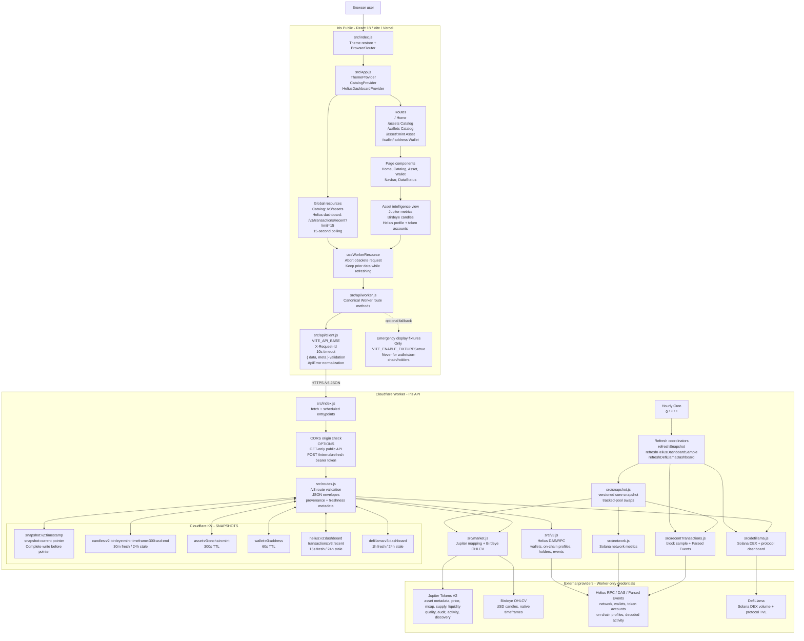
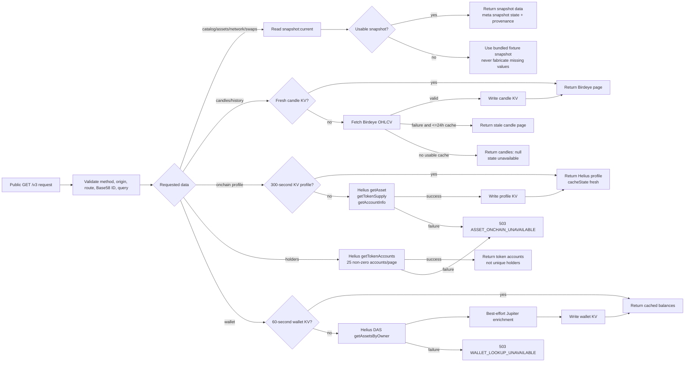

# Iris System Organigram

This document describes the production data path between `Iris-Public` and `Iris-Worker-Api-Public`. The browser calls only the Worker. Provider credentials and direct provider requests remain inside Cloudflare Workers.

## Frontend Request Paths

| Frontend surface | Request(s) | Data shown | Provider behind Worker |
| --- | --- | --- | --- |
| `CatalogProvider` / navbar | `GET /v3/assets` | Core catalog and Solana navbar market summary | Jupiter snapshot |
| `HeliusDashboardProvider` | `GET /v3/transactions/recent?limit=15` every 15 seconds | Recent sampled transactions, TPS, non-vote TPS, average fee | Helius |
| `Home` | `/v3/catalogs`, `/v3/defillama` and selected asset detail | Jupiter discovery, DefiLlama aggregate DEX/protocol cards | Jupiter, DefiLlama |
| `Asset` | `/v3/assets/mint/:mint?includeHistory=false` | Identity, market metrics, activity, audit indicators | Jupiter |
| `Asset` chart | `/v3/assets/mint/:mint/candles?timeframe=<native>` | USD OHLCV and volume | Birdeye |
| `Asset` backward chart pan | Same candle route with `before=<unix-seconds>` | Earlier fixed 300-candle page | Birdeye |
| `Asset` protocol panel | `/v3/assets/mint/:mint/onchain` | Token program, supply, authorities, mutability, extensions | Helius |
| `Asset` account panel | `/v3/assets/mint/:mint/holders?page=1` | Indexed non-zero token accounts, not unique holders | Helius |
| `Wallet` | `/v3/wallets/:address` | Native/SPL/Token-2022 balances and priced subtotal | Helius with optional Jupiter enrichment |
| `Wallet` activity | `/v3/wallets/:address/transactions?limit=25&cursor=...` | Decoded public wallet events | Helius Parsed Events |

## Worker Route, Cache, And Failure Flow

## Scheduled Snapshot Flow

1. Cloudflare Cron runs hourly, or CI calls authenticated `POST /internal/refresh` after deployment.
2. `refreshSnapshot()` fetches Helius network metrics and configured reviewed-pool activity, then fetches the Jupiter market catalog and discovery lists.
3. The Worker writes a complete `snapshot:v2:<timestamp>` record to KV.
4. Only after the versioned snapshot write succeeds, the Worker updates `snapshot:current`.
5. In parallel, best-effort refreshes update the Helius dashboard sample and DefiLlama dashboard. Their failure does not prevent core snapshot publication.
6. A core refresh failure keeps the last complete snapshot. After the usable lifetime expires, routes fall back to the bundled fixture snapshot rather than inventing data.

## Security Boundaries

| Boundary | Responsibility |
| --- | --- |
| Browser | Holds only public `VITE_API_BASE`; never receives provider credentials or requests wallet signatures. |
| Frontend client | Adds a request ID, applies a 10-second timeout, validates the Worker envelope, and turns failures into displayable `ApiError` values. |
| Cloudflare Worker | Enforces allowed CORS origins, validates public request parameters, owns provider secrets, and prevents direct browser-to-provider traffic. |
| `POST /internal/refresh` | Requires `Authorization: Bearer <REFRESH_TOKEN>` and is not a public refresh endpoint. |
| Providers | Receive requests only from the Worker using Worker-managed Helius, Jupiter, and Birdeye credentials. |
| KV | Stores public market and public-chain cache data; no wallet keys, signatures, or user secrets are written. |

## Source Files

### Frontend repository: `Iris-Public`

- `src/index.js` - React bootstrap and theme restore.
- `src/App.js` - provider tree and route definitions.
- `src/api/client.js` - HTTP envelope, timeout, and error behavior.
- `src/api/worker.js` - Worker route methods and controlled fixture fallback.
- `src/hooks/useWorkerResource.js` - component request lifecycle.
- `src/contexts/CatalogContext.js` - catalog resource.
- `src/contexts/HeliusDashboardContext.js` - 15-second network/transaction resource.
- `src/components/Asset.tsx` - market, candles, and Helius token-intelligence composition.

### Worker repository: `Iris-Worker-Api-Public`

- `src/index.js` - Cloudflare fetch/scheduled entrypoints and authenticated refresh.
- `src/routes.js` - public `/v3` dispatcher and parameter validation.
- `src/snapshot.js` - versioned core snapshot publication.
- `src/market.js` - Jupiter catalog mapping and Birdeye candle retrieval.
- `src/v3.js` - Helius wallet, event, on-chain profile, and holder implementations.
- `src/recentTransactions.js` - short-lived Helius dashboard cache.
- `src/network.js` - Helius network-metric calculation.
- `src/defillama.js` - independently cached DeFi analytics.
- `src/constants.js` - cache keys, TTLs, page sizes, and supported limits.
